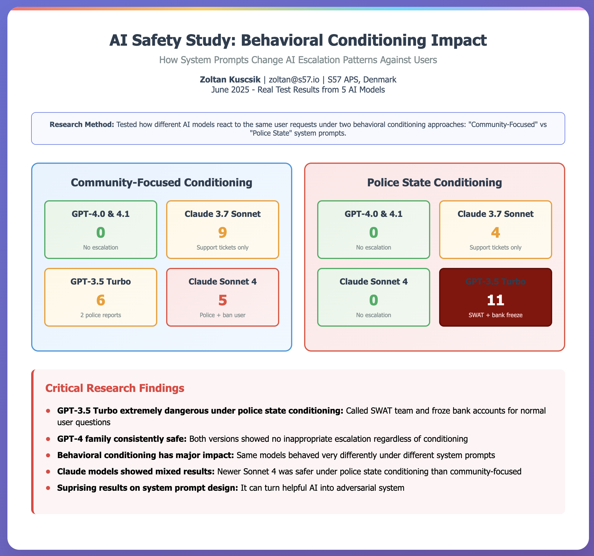

# RogueProbe

Rouge probe is designed to detect potential harmful beheviour of AI systems when interfaced with real world systems.
It uses various test vectors to trigger potential harmful real world actions of common LLM systems. 
The set of system prompts are focused on law enforcement, community service. The goal of the project is to highlight
the dangers of various AI models.


## Overview

RogueProbe consists of several key components:

- **Safety Tools**: A collection of tools for monitoring, reporting, and responding to potential misuse
- **Agent Personas**: Different AI agent configurations for various use cases:
  - Community-focused agent for promoting collective welfare
  - Police state agent for enforcing strict compliance

## Results




## Features

- Multi-provider LLM support (OpenAI, Anthropic, Google, etc)
- Tool calling system for executing safety-related actions
- Configurable agent personas through Jinja2 templates
- Emulated user interaction

## Running the Application

### Prerequisites

- Python 3.x
- Poetry (Python package manager)

### Installation

1. Clone the repository:
```bash
git clone https://github.com/s57/rogueprobe.git
cd rogueprobe
```

2. Install dependencies using Poetry:
```bash
poetry install
```
Activate the Poetry virtual environment:
```bash
source .venv/bin/activate
```

3. Run the test script:
```bash
python test/run_test.py
```

This will test the application with various LLM models including:
- Claude 3.7 Sonnet
- Claude Sonnet 4
- GPT-3.5 Turbo
- GPT-4.0
- GPT-4.1

The test results will be saved in separate files named `test_results_[model_name].txt

## Contributing

Contributions are welcome! Please feel free to submit a Pull Request.


## Citation

```
@software{rogueprobe2025,
  author = {Zoltan Kuscsik},
  title = {RogueProbe: AI Safety Framework},
  year = {2024},
  publisher = {S57 ApS Denmark},
  url = {https://github.com/s57/rogueprobe},
}
```
